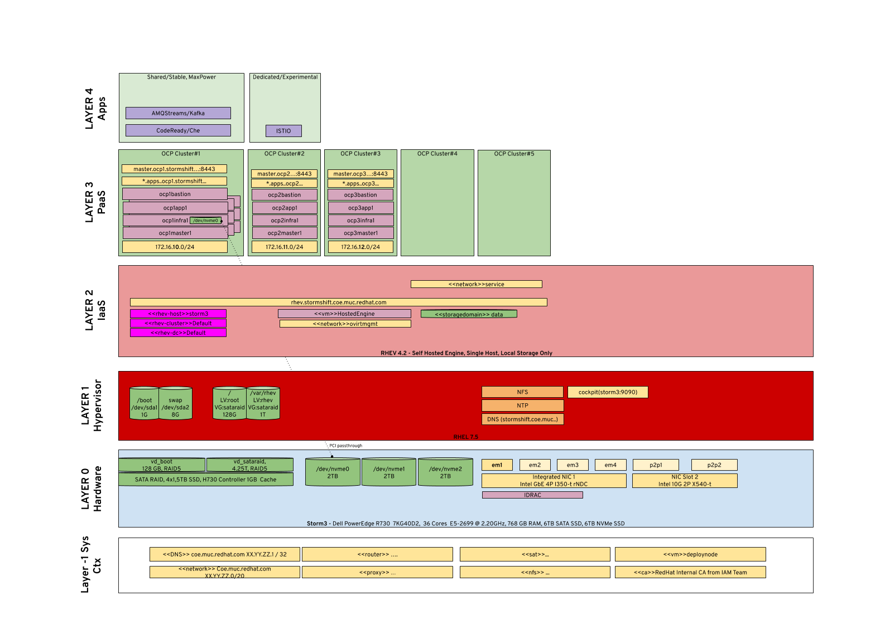

# Purpose
Ansible Playbooks to deploy:
- RHEL onto a bare metal server, using IDRAC Ansible modules
- RHEV onto that RHEL
- A set of OpenShift Cluster onto RHEV.
- A set of applications onto an OpenShift Cluster (e.g. ISTIO)

# Usage
Example:
Create OpenShift Cluster OCP2 requires three steps:
1. Create the RHEV VMs
1. Prepare these VMs so that OpenShift Pre-Reqs are fulfilled.
1. Install OpenShift onto these VMs

```bash
ansible-playbook -i cfg/inventory.yml -e @cfg/ocp2.yml  300_ocp_create_nodes.yml  
ansible-playbook -i cfg/inventory.yml -e @cfg/ocp2.yml  310_ocp_prepare_nodes.yml  
ansible-playbook -i cfg/inventory.yml -e @cfg/ocp2.yml  320_ocp_install_nodes.yml  
```
This shows the structure and procedure nicely. Check the playbooks for tags, there are plenty of them to be able to easily run/skip only certain parts.


# Big Picture
The overall design looks like this:

