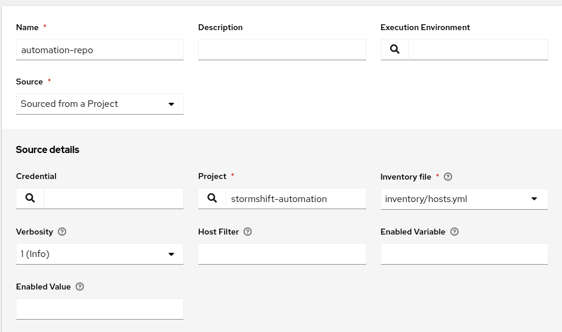

# All about StormShift Automation

Ansible based, of course! (and a litle bit of gitops)

## Cluster as a Service via Ansible Automation Platform

We want to provide
 * Standalone OpenShift Cluster on OpenShift Virtualization Control plan as VM ) [Issue: create automation for ocp cluster mno #76
](https://github.com/stormshift/automation/issues/76)
   * From Single-Node over Compact to full-blown OpenShift Clusters.
 * Hosted Control Plane (HCP) Cluster with KubeVirt/OpenShift-Virt provider 
 * RHEL for Edge / MicroShift deployments


## Standalone / HCP Cluster - Design

 * Playbooks should provide a ready to use cluster.
   * No addtional ACM/GitOps integration is needed, but optional possible
 * Core playbooks/roles provide a cluster and the cluster can enrich with feature roles that are executed during installation. Example for features:
   * kubevirt-csi driver configuration and deployment [roles/feature-kubevirt-csi](roles/feature-kubevirt-csi)
   * Adding cluster to central ACM instance [roles/feature-manage-with-acm](roles/feature-manage-with-acm)
   * ...

### Infrastructure to host the clusters

  * Bare-Metal OpenShift Virtualization Cluster - called managment (mgmt.) cluster
  * Mgmt. Cluster provides various storage backends
    * Red Hat OpenShift Data Foundation
    * NetApp Trident
    * LVMS (For HCP etcd only)
    * ...
  * Every cluster running at the mgmt. cluster get his own namespace/project like that: `stormshift-<cluster-name>-infra` for example `stormshift-ocp11-infra`
  * At the mgmt. Cluster there will be group `stormshift-admins` this group gets admin privileges on all stormshift related projects.
  * The last person who deployed a cluster gets cluster admin on the cluster-specific namespace as well.
  * All clusters & nodes are predefined in a ansible inventory: [inventory/hosts.yml](inventory/hosts.yml) - more details look into [Ansible inventory description](#inventory)

#### <a name="inventory"></a>Ansible inventory description

The inventory is managed in the [inventory/](inventory/) folder.

 * Every cluster is a ansible group `cluster_<cluster-name>` for example <cluster_ocp11> and as subgroups:
    * `cluster_<cluster-name>_cp` for control plane
    * `cluster_<cluster-name>_workers` for worker nodes
     
 * Every node in a cluster is part of the group.
 * Every node start with the `<cluster-name>`-control-1 for example:
   * `ocp11-control-1`
   * `ocp11-control-2`
   * `ocp11-control-3`
   * `ocp11-worker-1`
   * ...
```bash
inventory
├── group_vars
│   ├── all.yaml
│   ├── cluster_ocp11.yaml
...
├── host_vars
│   ├── ocp11-control-1.yaml
└── hosts.yml
```

## Ansible Automation Platform Configuration

 * Create `stormshift` organisation
 * Create `stormshift-admin` team, make team to stormshift org. admin/full-access
 * Add execution environment to stormshift organisation
 * Add project `stormshift-automation` with this repo to the stormshift organisation as well.
 * Add `stormshift-inventory` inventory
    * Add source `automation-repo` based on `Source from project`:
        * Important - Inventory file: `inventory/hosts.yml`
        
 * Deploy stormshift  

## Ansible playbook and role structure/idea

 * One playbook to rule them all:
    * `deploy-cluster.yaml`
    * `destroy-cluster.yaml`
 * Playbook is splitted into 3 steps aka plays:
    * pre-deploy - runs against hosts[0] - only the first one
    * deploy instances/vm's - runs against all hosts to create and start all VM's
    * post-deploy - runs against hosts[0] - only the first one
 * Main role called cluster
   * Main tasks files:
      * `pre-deploy-cluster-{{ cluster_type (sno|classic) }}.yaml`
      * `deploy-cluster-{{ cluster_type (sno|classic) }}.yaml`
      * `post-deploy-cluster-{{ cluster_type (sno|classic) }}.yaml`

## Run playbooks local

### Podman machine at MacOS

```bash
podman machine init \
    --volume /private:/private \
    --volume /Volumes/Development:/Volumes/Development \
    --volume /Users:/Users \
    --volume /var/folders:/var/folders \
    --memory 4096 podman-machine-default

# Start machine
podman machine start

# Inject Red Hat Root CA
# https://github.com/containers/podman/blob/main/docs/tutorials/podman-install-certificate-authority.md
podman machine ssh --username root

cd /etc/pki/ca-trust/source/anchors
curl -k -O http://inf1.coe.muc.redhat.com/Current-IT-Root-CAs.crt
update-ca-trust

```


### Prep configuration
```bash
# add all informations
cp -v development-example.vars development-example.vars-private
vim development-example.vars-private
cp -v development-example.env development-example.env-private
vim development-example.env-private

# Load env variables
source development-example.env-private
```

### Run it, a few examples

```bash

ansible-navigator run stormshift-cluster-mgmt.yaml \
    -e stormshift_cluster_action=deploy \
    -e stormshift_cluster_name=ocp1 \
    --vault-password-file=.vault_pass \
    -e @development-example.vars-private \
    -e '{ "stormshift_cluster_features": ["redhat-internal-certificate","coe-sso","look-and-feel"]}'

ansible-navigator run stormshift-cluster-mgmt.yaml \
    -e stormshift_cluster_action=add-features \
    -e stormshift_cluster_name=ocp7 \
    --vault-password-file=.vault_pass \
    -e @development-example.vars-private \
    -e '{ "stormshift_cluster_features": ["netapp-trident"]}'

ansible-navigator run configure-job-templates.yaml \
    --vault-password-file=.vault_pass \
    -e @development-example.vars-private \
    -l ocp3

ansible-navigator run configure-job-templates.yaml \
    --vault-password-file=.vault_pass \
    -e @development-example.vars-private -v

ansible-navigator run request-cert.yaml \
    --vault-password-file=.vault_pass \
    -e @development-example.vars-private \
    -e common_name=api.ocp1.stormshift.coe.muc.redhat.com \
    -e subject_alt_name='DNS:api.ocp1.stormshift.coe.muc.redhat.com,DNS:*.apps.ocp1.stormshift.coe.muc.redhat.com' \
    -e tower_user_email=rbohne@redhat.com \
    -e tower_user_name='Robert Bohne'

# Download all kubeconfigs
source development-example.env-private
ansible-navigator run scrible/download-kubeconfigs-from-vault.yaml \
    --vault-password-file=.vault_pass \
    -e kubeswitch=true \
    -l ocp1
```

## Ansible inventory structure (folder: `inventory/`)

Documentation:
 * <https://docs.ansible.com/ansible/latest/inventory_guide/intro_inventory.html#organizing-host-and-group-variables>

How do dump the entire inventory locally:

```
ansible-navigator run dump-inventory.yaml --list-hosts
```

How to dump vars of a host locally:

```
ansible-navigator run dump-inventory.yaml --limit common-pattern*
```

* common-pattern: https://docs.ansible.com/ansible/latest/inventory_guide/intro_patterns.html#common-patterns

## How to build execution env.

```bash
podman login registry.redhat.io
podman login quay.coe.muc.redhat.com
export VERSION=$(date +%Y%m%d%H%M)
export IMAGE=quay.coe.muc.redhat.com/stormshift/automation-execution-environment:${VERSION}
```

### Build on Linux/RHEL

```bash
ansible-builder build \
    --verbosity 3 \
    --container-runtime podman \
    --tag ${IMAGE}
podman push ${IMAGE}
```

### Multi-arch build on Mac OS:

Right now it doesn't work, because we don't a entitlement.

```bash
ansible-builder create \
    --verbosity 3

podman build --platform linux/amd64,linux/arm64 \
   --manifest ${IMAGE} context/

podman manifest push ${IMAGE}
```


