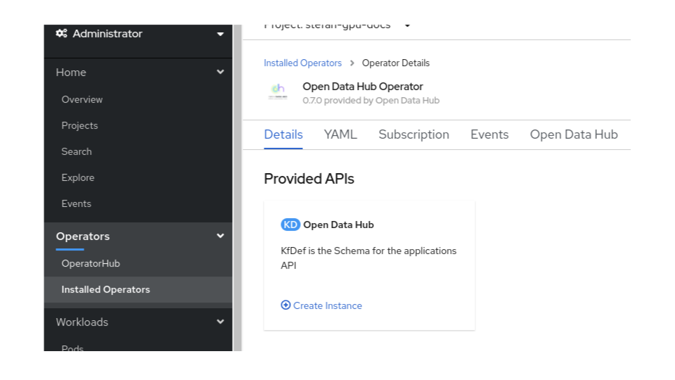
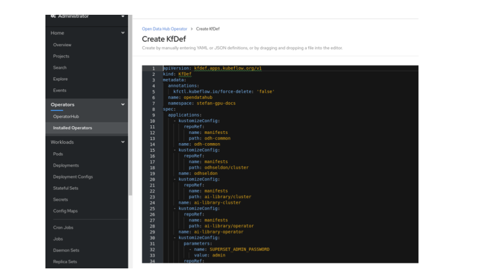
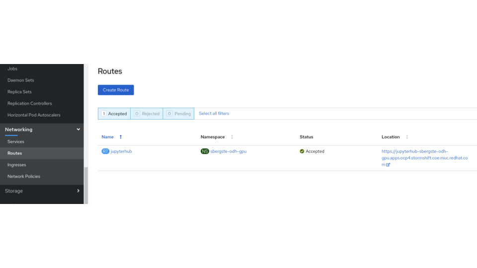
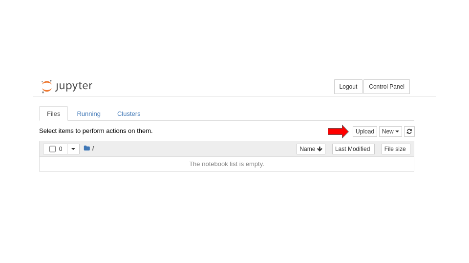

# StormShift GPU Demo
Showcase the availability and performance of GPUs on OpenShift.

Check the availability of a GPU before you start.

## Brief performance tests of CPUs vs GPU with TensorFlow
Note, the demo flow contains a few workarounds due to few issues with Open Data Hub 0.7.0. 

### Install Open Data Hub 

The Open Data Hub Operator 0.7.0 is usually already installed cluster wide on OCP4 and OCP5. You just need to create your own project, wait until the Open Data Hub operator is visible and create an instance.

#### Create an Open Data Hub instance

In your newly created project, navigate to Installed Operators and open the Open Data Hub Operator:



Click on create instance in the Open Data Hub tile.
The default KfDef will show up:



Delete the whole content and insert the content of the custom Kfdef as follows:

[Open Data Hub Kfdef with GPU specific changes for ODH 0.7.0 for OCP 4.5](files/odh-kfdef-gpu-070.yaml)

Click ```[Create]```

This KfDef triggers the builds of the GPU notebooks due to the ```- cuda``` parameter.

```
...
        parameters:
          - name: cuda_version
            value: "10.2"
        overlays:
          - cuda
...
```
Navigate in the OpenShift Admin Console to ```Build -> Builds``` and watch the notebook builds until the finish. (this will take some time)

### Lauch Jupyter Hub

Launch Jupyter Hub by clicking on the location of Jupyterhub route:


Sign in with OpenShift credentials.

Enter the needed data in the Jupyter Spawner Options:

- Select the tesorflow-gpu notebook
- Set  GPU = 1
- Add a variable LD_LIBRARY_PATH = $LD_LIBRARY_PATH:/opt/app-root/lib64


Start the Jupyter Hub, presse ```[Spawn]```! (it will take some time)

If no GPU is free, you will see ``` [Warning] 0/6 nodes are available: 6 Insufficient nvidia.com/gpu.  ```

### Upload demo notebook

Download the demo notebook on your laptop/desktop:
[tensorflow-with-gpu.ipynb](files/tensorflow-with-gpu.ipynb)

```
curl -O https://raw.githubusercontent.com/DanielFroehlich/stormshift/master/docs/files/tensorflow-with-gpu.ipynb
```


In the Jupyter Hub select ```[Upload]```, and upload the previously downloaded notebook ```tensorflow-with-gpu.ipynb```:



Open the notebook and follow the instructions.

### Showcase the performance of CPUs vs GPU with TensorFlow

The notebook should have enough information so that you can follow it and demo. 
Anyhoe, here a few tips:
- Run cells step by step with ```shift-enter```
- As long as the cell number show a [*], the cell is still running. 
- Clear all cells with ```Cells -> Current Outputs -> Clear``` or ```Kernel -> Restart and Clear Output```
- The steps/cells in **Prepare the notebook** are ugly. Please run them before you show the demo.
- You might have to run the cell below ```Plot results``` twice to see the bar chart.


## GPU based model training
For showing an end to end model training you can the Keras example [OCR model for reading Captchas](https://keras.io/examples/vision/captcha_ocr/)

- Upload the notebook [captcha_ocr.ipynb](files/captcha_ocr.ipynb)
- Ensure you have Tensorflow 2.3.0  installed: ```!pip install tensorflow-gpu==2.3.0```
- Step through notebook. The explanation are pretty good.
- During the training phase show how fast the model is learning:

```
...
Epoch 5/100
59/59 [==============================] - 7s 120ms/step - loss: 16.3321 - val_loss: 16.4150
Epoch 6/100
59/59 [==============================] - 7s 124ms/step - loss: 16.3303 - val_loss: 16.4162
Epoch 7/100
59/59 [==============================] - 8s 130ms/step - loss: 16.3219 - val_loss: 16.4019
...
Epoch 13/100
59/59 [==============================] - 9s 157ms/step - loss: 11.0869 - val_loss: 7.7286
Epoch 14/100
59/59 [==============================] - 9s 155ms/step - loss: 5.9264 - val_loss: 3.6818
Epoch 15/100
59/59 [==============================] - 8s 129ms/step - loss: 2.8195 - val_loss: 1.5599
Epoch 16/100
59/59 [==============================] - 9s 153ms/step - loss: 1.4770 - val_loss: 0.7692
Epoch 17/100
59/59 [==============================] - 8s 138ms/step - loss: 0.8761 - val_loss: 0.3705
...
```


## Show Tensorflow Jobs using a GPU

TBD


